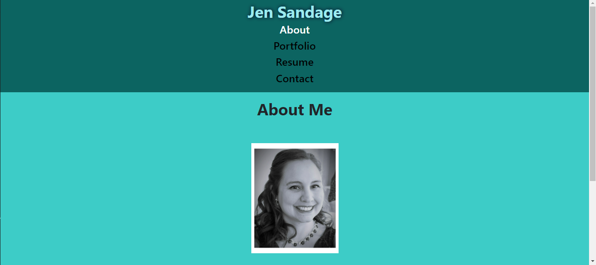
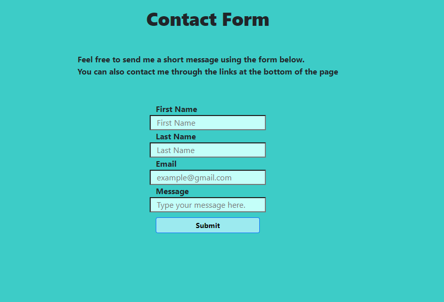
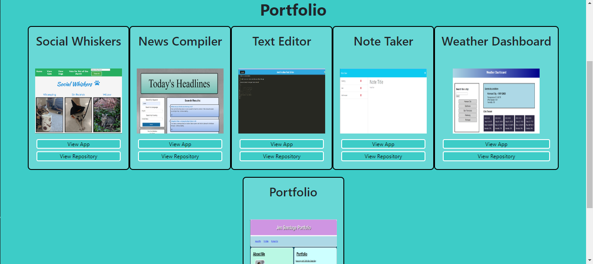
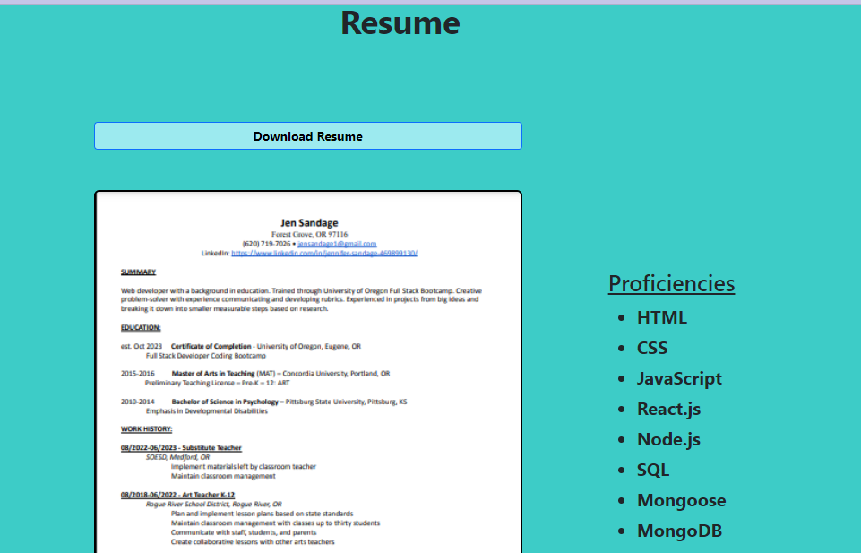

# React-Portfolio

## Description:
    This is a portfolio website that was created using React.js. 

## Table of Contents:
* [Installation](#installation)
* [Usage](#usage)
* [Credits](#credits)
* [License](#license)

## Installation
For installation for development, navigate to the root folder and run "npm install" to install all required packages. Run "npm run build" and then "npm run start" to see the application. 

## Usage
This is a portfolio for a user to showcase themselves in a professional setting. It has a nav bar at the top of the page with nav links that are highlighted to show what page the viewer is currently seeing. There is a footer at the bottom of the page that has links to the developers personal web pages for potential employers to look at or contact the developer. The content on the page is dynamically created based on the nav bar links. The portfolio page has examples of the developers work as well as working links to view the deployed apps and the repositories. The contact form is a way for anyone to send the developer a message. The resume page has a button where you can download a copy of the developers resume. 

## Credits

## License  

## Tests

## Questions

github repo:
https://github.com/jensandage1/React-Portfolio

Deployed App:
https://jen-sandage-portfolio-8964bab619bd.herokuapp.com/

